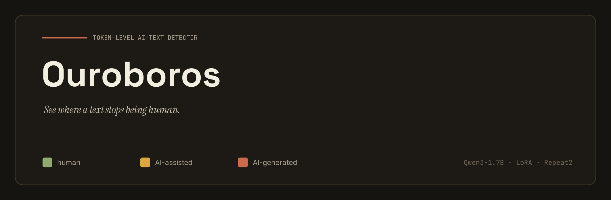
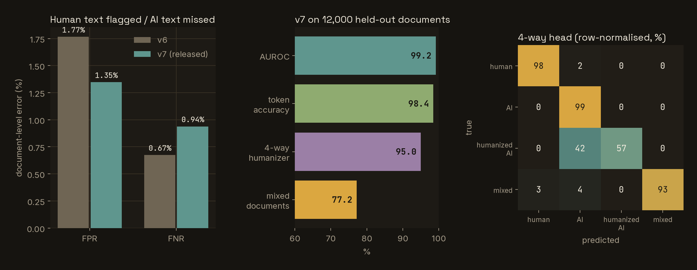
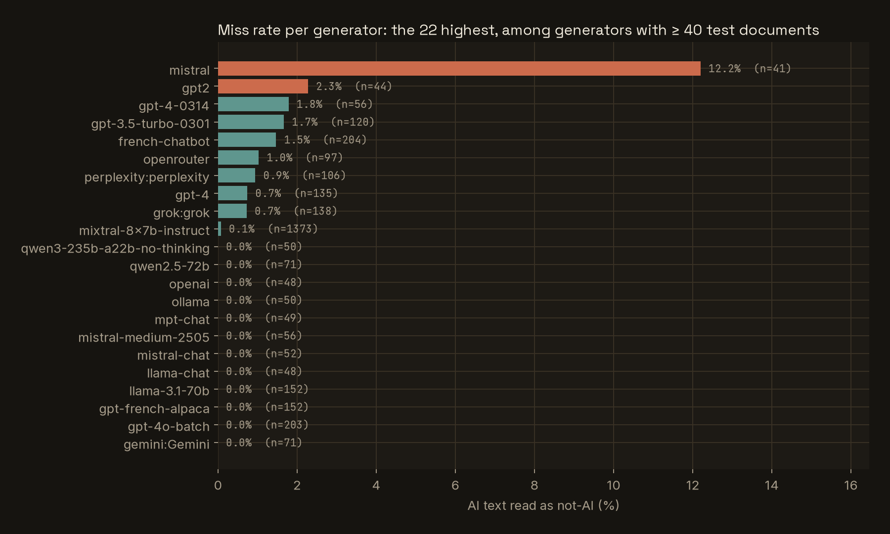
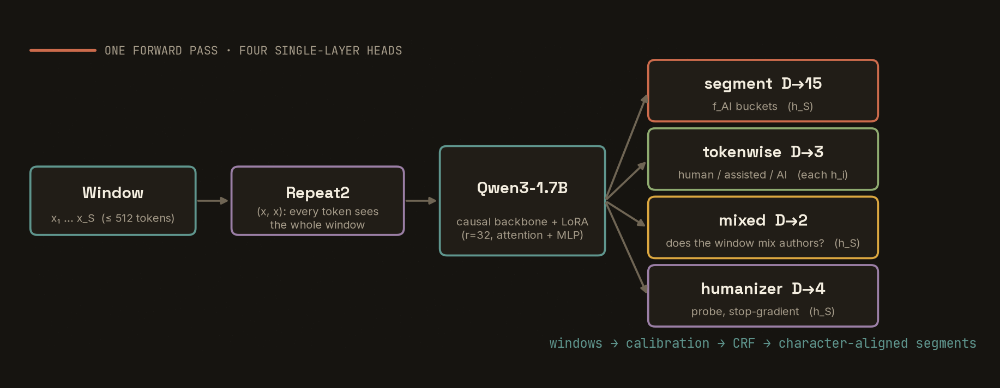
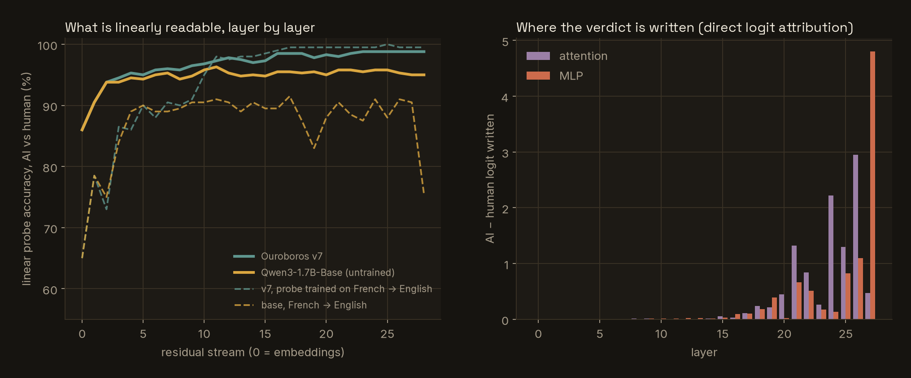
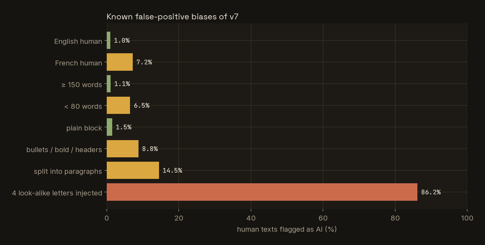

<div align="center">



[](LICENSE)
[](pyproject.toml)
[](https://huggingface.co/Qwen/Qwen3-1.7B-Base)
[](https://huggingface.co/Jour/ouroboros-detector)
[](tests)
[](#built-end-to-end-by-claude-opus-55)

[Quick start](#quick-start) · [Benchmarks](#benchmarks) · [How it works](#how-it-works) · [What it looks at](#what-the-model-actually-looks-at) · [Limitations](#limitations-and-known-biases) · [Training data](#training-data) · [Reproduce](#reproduce)

</div>

> **Unofficial.** Ouroboros is an independent, open reimplementation of the method described in the *Pangram 4* technical report ([arXiv:2607.27183](https://arxiv.org/abs/2607.27183)). It is not affiliated with, endorsed by, or a copy of Pangram's product, weights or data.

---

Most AI-text detectors give a single score for a whole document. Real text is often mixed — a human draft polished by a model, an AI answer with a paragraph pasted in by hand — and a document-level score can't say which part is which. It also hides failure modes that are easy to trigger by accident: a line wrap, a paragraph break, a handful of look-alike letters can flip a verdict. We measured that too; see [limitations](#limitations-and-known-biases).

Ouroboros keeps the paper's core idea — a tokenwise head on a causal LM, fed the window twice — and ships the rest around it: code, weights, the training pipeline, the benchmark, and a short interpretability study of what the model actually reads.

## What's in the box

| | |
|---|---|
| Token-level provenance | `human` / `ai-assisted` / `ai-generated`, character-aligned segments with confidence |
| Document fractions | weighted AI fraction `f_AI`, plus a `human` / `mixed` / `ai` verdict (a `mixed` result counts as an error for both FPR and FNR) |
| Humanizer probe | 4-way head: `human`, `ai-generated`, `humanized-ai`, `mixed-authorship` |
| Size | Qwen3-1.7B + merged LoRA, bf16, 3.4 GB — runs on a 12 GB consumer GPU |
| Interpretability | layer-by-layer probes, direct logit attribution, causal ablations — [see below](#what-the-model-actually-looks-at) |
| Reproducibility | dataset builder, two-stage trainer, calibrator, evaluator, 39 tests |

## Quick start

```bash
pip install "git+https://github.com/Jourdelune/ouroboros-detector.git"
```

```python
from ouroboros.infer.predict import Predictor

detector = Predictor.from_pretrained("Jour/ouroboros-detector")      # or a local directory
result = detector.predict(open("essay.txt").read())

print(result.document_label, round(result.weighted_ai_fraction, 3))  # e.g. mixed 0.592
for seg in result.segments:
    print(seg.start, seg.end, seg.label_name, round(seg.confidence, 3))
print(detector.humanizer(text))   # {'human': …, 'ai-generated': …, 'humanized-ai': …, 'mixed-authorship': …}
```

A real run, on a spliced document of the held-out test split (ground truth: characters 0–442 AI, 442–746 human):

```text
verdict: mixed | weighted AI fraction: 0.592
  [   0-442 ] ai-generated  conf 0.957 | She tells her story to a scribe, recounting her life from childhood in an orphanage…
  [ 442-746 ] human         conf 0.999 |  After a Neapolitan woman gives her a servant called Rampin, Lozana makes an agreement…
```

```bash
ouroboros predict --run-dir <model dir or hub id> --file essay.txt     # table of segments
python demo/app.py --run-dir <model dir or hub id>                    # Gradio demo → http://localhost:7860
```

<details>
<summary><b>Install for development / training</b></summary>

```bash
git clone https://github.com/Jourdelune/ouroboros-detector && cd ouroboros-detector
pip install -e ".[demo,train,dev]"
pytest -q            # 39 passed
```

Needs Python ≥ 3.12 and a CUDA GPU for training and fast inference (CPU works for short texts).
</details>

## Benchmarks

<div align="center"></div>

Held-out **test split of our own corpus**: 12,000 documents (4,531 human, 6,821 AI, 648 mixed), split by *source document* so nothing leaks between train, calibration and test. The operating point was set on a separate calibration split for a 0.5 % false-positive target.

| | v6 | **v7 (released)** |
|---|---:|---:|
| False-positive rate (human flagged) | 1.77 % | **1.35 %** |
| False-negative rate (AI or mixed missed) | 0.67 % | 0.94 % |
| AUROC | 0.9913 | **0.9915** |
| TPR @ 1 % FPR | 99.2 % | 98.9 % |
| Token accuracy | 98.5 % | 98.4 % |
| Token F1 — human / AI-assisted / AI-generated | 0.988 / 0.743 / 0.988 | 0.986 / 0.714 / 0.988 |
| Mixed-document accuracy | 81.6 % | 77.2 % |
| 4-way humanizer head, accuracy | 94.9 % | 95.0 % |
| … recall on `humanized-ai` | 54.1 % | 56.8 % |

A few things worth knowing before you read these numbers as "accuracy":

- The test set comes from the *same* corpus families as the training data (same generators and source datasets, different documents). This measures in-distribution quality, not how the model does on your text.
- It is **not comparable** to the Pangram report's FPR/FNR, which use a different, proprietary corpus and a much larger backbone.
- v7 trades some mixed-document accuracy and FNR for a lower FPR than v6. Which direction is better depends on what an error costs you.
- The weakest cases are the humanized class (57 % recall — the other 42 % of humanized AI is read as plain AI, which is still a detection, just the wrong label) and the `ai-assisted` class (F1 0.71).

<details>
<summary><b>Miss rate per generator</b> (22 highest among generators with ≥ 40 test documents)</summary>



The test set covers 218 generators. Almost all are caught on every document; the outlier is a Mistral-family subset (12 %, n = 41).
</details>

## How it works

<div align="center"></div>

One shared causal backbone with a LoRA adapter, and four single-dense-layer heads (report §4.1):

| head | shape | reads | purpose |
|---|---|---|---|
| segment | `D → 15` | `h_S` | weighted AI fraction `f_AI`, discretised into 15 ordered buckets |
| tokenwise provenance | `D → 3` | every `h_i` | `{human, ai-assisted, ai-generated}` per token |
| mixed-authorship | `D → 2` | `h_S` | does this window mix authors? |
| humanizer | `D → 4` | `h_S` (**stop-gradient**) | `{human, ai-generated, humanized-ai, mixed-authorship}` |

- **Repeat2.** A tokenwise head on a causal model is ill-posed — early tokens see almost nothing. The 512-token window is fed twice, `(x, x)`, and the loss is masked over the first copy, so every supervised token has the whole window in its receptive field.
- **Labels without ground truth: Soft N-Grams.** For *(human source S, AI-edited target T)* pairs, each clause of T is matched to its best span in S: lexical overlap → `human`; semantic similarity → `ai-assisted`; neither → `ai-generated`. `f_AI = (0.5·C_assisted + C_AI) / (C_human + C_assisted + C_AI)`.
- **Decoding.** Sliding windows → per-window distributions → calibration → a linear-chain CRF (Potts transitions relaxed where the mixed head says the window mixes authors) → Viterbi → sentence voting → character-aligned segments. Verdict: `human` if `f_human ≥ 0.90`, `ai` if `f_AI ≥ 0.80`, else `mixed`.

<details>
<summary><b>Training recipe and lineage</b></summary>

- Stage 1 (single-copy 512-token windows; segment + humanizer-probe heads) → merge the adapter → stage 2 (Repeat2; adds the tokenwise and mixed heads). The released model is the end of a chain of continued stage-2 fine-tunings, each on a bigger corpus plus the cases the previous model still got wrong (active learning, report §4.2). See [`configs/v7_stage2.yaml`](configs/v7_stage2.yaml).
- LoRA `r = 32, α = 64` on attention and MLP projections, bf16, 6,000 steps of 16 windows for the last round.
- **Format shortcuts are fixed on both classes.** Hard line wraps, single-line text, and short passages were each strongly correlated with one class in public data. [`scripts/augment_formats.py`](scripts/augment_formats.py) applies wrap / flatten / short-excerpt augmentations to human *and* AI text so none of them becomes evidence for either.
- Human sources whose "human" label is unreliable (machine translation, pasted chatbot answers) are dropped.
</details>

## What the model actually looks at

We opened the model up. Everything below is measured on held-out test passages (English and French, 400–1,600 documents per analysis), with 95 % intervals (Wilson for proportions, bootstrap over documents otherwise). The analysis scripts (probes, direct logit attribution, ablations, bias audit) are research code written against the internal checkout and are **not** part of this release; only their results are reported here.

<div align="center"></div>

- **Most of it is already in the pre-trained model.** A linear probe on the *untrained* Qwen3-1.7B-Base separates human from AI at 95 % [93–97]; fine-tuning raises that to 98.5 % [97–99] and, above all, makes it **language-independent**: a probe trained on French and tested on English scores 99.5 % [97–100] on Ouroboros against 91.5 % [87–95] on the base model.
- **The verdict is written late.** Direct logit attribution (exact, reconstruction correlation 0.9999) puts nearly all of the AI-minus-human logit in layers 18–27: two attention heads (L24H2, L26H10) and the last MLP carry the largest shares. Removing the eight most important heads cuts the separation by 31 % [30–32] and leaves accuracy at 98.8 %, so the signal is **redundant**, not concentrated in a single circuit.
- **Sentence boundaries do disproportionate work.** The final period of a sentence is 2.4 % of the tokens and carries 28 % [25–31] of the evidence; paragraph breaks are 0.8 % of the tokens and carry 21 % [19–24]. Blocking attention to boundary tokens in layers 18–27 lowers the separation by 15 %; blocking the same number of random words changes it by +1 %.
- **It reads sentence construction, not vocabulary or decoration.** Shuffling the words inside each sentence lowers the AI logit by 6.7 [6.1–7.3] and flips 41 % of AI texts; surface edits (markdown, connectors, contractions, typos, punctuation) move it by at most 0.6 logit.
- **It is not a perplexity detector.** The correlation between v7's score and a base language model's surprisal, within AI texts, is 0.09 [−0.05, 0.24].
- **One sentence is often enough.** 82 % of isolated AI sentences are detected, and 87 % of isolated human sentences are cleared.

## Limitations and known biases

<div align="center"></div>

These are our own measurements of v7, not a generic disclaimer — we'd rather you read them here than find them in production.

| | human texts flagged as AI |
|---|---:|
| English | 1.0 % |
| **French** | **7.0 %** (n = 500) |
| ≥ 150 words | 1.1 % |
| **< 80 words** | **6.5 %** |
| Plain single block | 1.5 % |
| **Bullets / bold / headers** | **8.8 %** [3 – 23] |
| Human text split into paragraphs | **14.5 %** [12 – 18] |
| Human text with 4 look-alike (Cyrillic) letters | **86.2 %** [84 – 88] |

- **Format and encoding shortcuts.** A few homoglyphs flip most human texts to "AI": homoglyphs were far more common in the AI training data than in the human data (≈ 4 % vs 0.4 % of documents). Normalise confusable characters before inference if your inputs may contain them. A follow-up fine-tune reduced this to 12 % but cost accuracy elsewhere and is not released.
- **French and short texts** are measurably worse; texts under 50 words are not supported (`min_words`).
- **Adaptive adversaries.** The detector is not robust against someone who can query its score. A prompt-driven rewriting loop with best-of-N sampling and feedback on the detector's own output made 70–88 % of a small held-out set (50 French and 50 English passages) read as human, while the rewrites still passed automatic fidelity checks (sentence-level entailment, numbers, grammar, copying). Treat a verdict as evidence, not proof, and never as the sole basis for a decision about a person.
- **False positives have victims.** AI-text detectors can wrongly flag non-native writers and formal prose. Keep a human in the loop.
- Labels for "human" in public datasets are imperfect, and the corpus mixes generators from many years; recent frontier models change quickly.

## Training data

The corpus is built from **public** sources (nothing proprietary): the RAID benchmark; MAGE; COLING-2025 MGT; ai-text-detection-pile; `dmitva/human_ai_generated_text`; Cosmopedia; WildChat and UltraChat; OpenHermes-2.5; LMSYS-style arena preference sets; Amazon, Yelp and IMDB reviews; arXiv abstracts; FineWeb-2 (French) and FineWeb-Edu; the Aya dataset; Wikipedia; French instruction sets; and several public distillation sets from recent frontier models. The full list of 48 recipes, with each dataset's label convention, is in [`src/ouroboros/data/hf_sources.py`](src/ouroboros/data/hf_sources.py).

The final training set holds ≈ 1.09 M documents (including augmentations), with held-out eval (73 k), calibration (72 k) and test (98 k) splits made by source document.

> **Licences.** The code is Apache-2.0 and the backbone (Qwen3) is Apache-2.0, but the training data comes from many datasets, each under its own terms (some research-only or non-commercial). **Check the licence of every dataset you use before reusing the data or the weights commercially.** We do not redistribute any dataset.

## Reproduce

[`scripts/build_dataset.sh`](scripts/build_dataset.sh) lists every stage with the commands and settings used: sample RAID → fetch Hugging Face corpora → generate AI edits of human text → assemble the span-annotated corpus → format augmentation → two-stage training → calibration → evaluation → active-learning mining.

```bash
RAID_CSV=/path/to/raid/train.csv WORK=./data ./scripts/build_dataset.sh           # all stages
./scripts/build_dataset.sh fetch                                                  # or one stage
ouroboros train --config configs/stage1.yaml --stage2-config configs/stage2.yaml
ouroboros calibrate --run-dir runs/stage2 --shards data/corpus/calibration.jsonl
ouroboros eval --run-dir runs/stage2 --shards data/corpus/test.jsonl
```

This reproduces the **structure** of the pipeline, not the released weights bit for bit: the corpus grew over several rounds, some Hugging Face fetches were run interactively, and part of the recent-model data came from a paid API. Each stage (format augmentation, dataset fetch, the CLI, model loading, the 39 tests) was run and checked for this release; the full pipeline was not re-run end to end.

## Built end to end by Claude Opus 5.5

The architecture implementation, data pipeline, training runs, evaluation, interpretability study, bias audit, demo and this README were written and run by **Claude Opus 5.5** (Anthropic), working as an autonomous coding agent, at the direction of the repository's author, who set the goals, chose the trade-offs and reviewed the results. The numbers above come from result files produced during the project; the model-loading, evaluation and data code in this repository was run and checked for the release. The analysis scripts behind the interpretability section were not included — only their output was.

## Acknowledgements

The method is from the Pangram 4 technical report ([arXiv:2607.27183](https://arxiv.org/abs/2607.27183)); Repeat2 follows [arXiv:2505.01475](https://arxiv.org/abs/2505.01475). Thanks to the maintainers of RAID, MAGE, COLING-2025 MGT, WildChat, Cosmopedia, FineWeb and the other public datasets; to the Qwen team for the backbone; and to the authors of the Hugging Face `transformers`, `peft` and Gradio libraries.

## License and citation

Code: [Apache-2.0](LICENSE). Please also respect the licences of the datasets listed above.

```bibtex
@software{ouroboros_detector,
  title  = {Ouroboros: an open token-level AI-text detector},
  author = {Jourdelune},
  year   = {2026},
  note   = {Unofficial reimplementation of the Pangram 4 technical report (arXiv:2607.27183); built end to end with Claude Opus 5.5},
  url    = {https://github.com/Jourdelune/ouroboros-detector}
}
```
